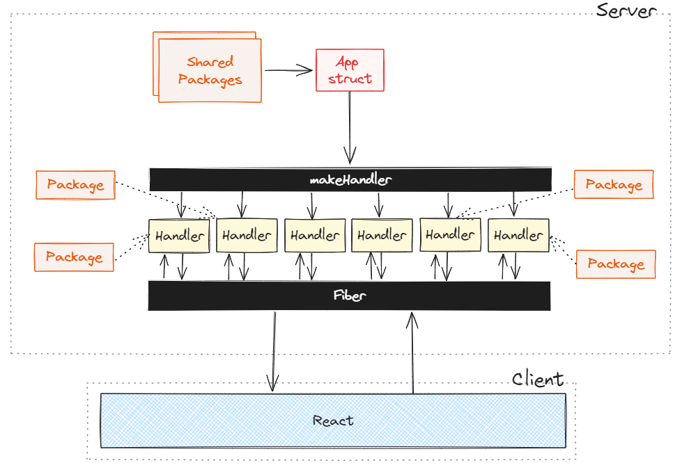
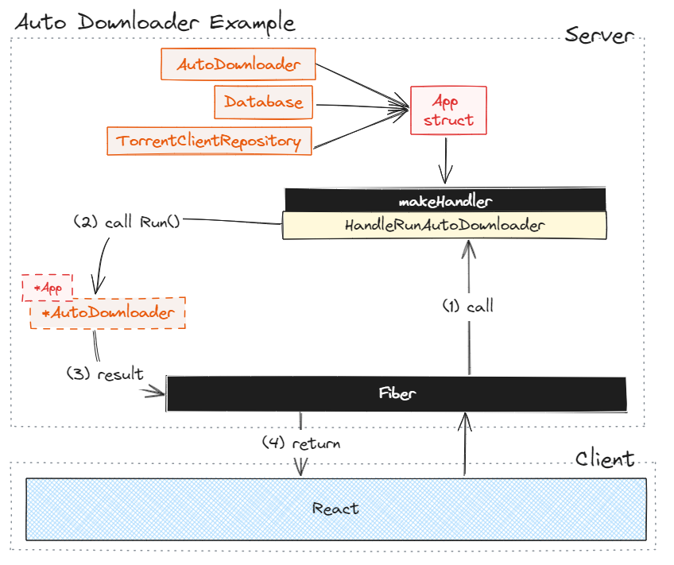

# Development

To get started, you will need to be familiar with Go and Typescript.

I recommend creating a dummy AniList account for testing purposes.

## Server

Run this command to start the server:
```bash
go run cmd/main.go
```

I recommend passing the `--datadir` flag to specify a test data directory. This will prevent the server from writing to your actual data directory.

```bash
go run cmd/main.go --datadir="path/to/test/data"
```

## Web

```bash
cd seanime-web
```

```bash
npm install
```

```bash
npm run dev
```

- Go to `http://127.0.0.1:43210` to access the web interface.

Notice that unlike the normal setup, the development web interface runs on port `43210` and is not
served by the server for obvious reasons. This will not impact any functionality except MyAnimeList OAuth.

## API Documentation

Once both the server and the web interface are running, you can access the auto-generated documentation
of the API routes by going to `http://127.0.0.1:43210/docs`.

This documentation is generated by running:

```bash
cd seanime-docs
go run main.go
```

# Build

## Server

Build the server using the following command:

```bash
go build -o seanime cmd/main.go
```

This will create a `seanime` binary in the root of the project.

You can keep it there or move it to a more appropriate location.

## Web

Build the web interface using the following command:

```bash
npm run build
```

After the build process is complete, a new `out` directory will be created under the `seanime-web` folder.

This is essentially what the server serves when you access the web interface in a normal setup.

You now need to copy the contents of the `out` directory to a `web` directory in the root of the project or wherever
the built server binary is located.

# Structure and tests

## Overview





As you can see from the overview, Seanime is divided into two main parts: the server and the web interface.
Once the server starts, an **App** struct is instantiated and passed to all **route handlers** by reference.
Think of it as a big hub containing pointers to instantiated **shared services** that the handlers will pass to **localized route-level services** before calling the business logic.

For example, the **AnilistCollection** struct is fetched once and passed by reference to the **App** struct. It is then
accessible by the different route handlers. A route executing business logic might use it or other shared services.

Some services like the **Scanner** are instantiated at the route handler level since they are not used by any other service.
Though, the **Scanner** may need a pointer to a shared resource like **AnilistCollection**, which is given by the **App** struct.

All services only depend on a specific set of packages instead of the whole **App** struct. It is a form of dependency injection. This makes them testable and easy to reason about.
For example, the **Scanner** doesn't depend on the **AutoDownloader** and vice versa.


## AniList GraphQL API

Anilist queries are defined in `internal/anilist/queries/*.graphql` and generated using `gqlgenc`.

Run this when you make changes to the GraphQL schema.

```bash
go get github.com/Yamashou/gqlgenc
cd internal/api/anilist
go run github.com/Yamashou/gqlgenc
cd ../../..
go mod tidy
```

`gqlgenc` will generate the different queries, mutations and structs associated with the AniList API and the queries we defined.
These are located in `internal/api/anilist/clieng_gen.go`.


In `internal/api/anilist/client.go`, we manually reimplements the different queries and mutations into a `ClientWrapper` struct and a `MockClientWrapper` for testing.
This is done to avoid using the generated code directly in the business logic. It also allows us to mock the AniList API for testing.

## Tests

**Do not** run the tests all at once. Run them **individually** if you have to.

You should:
- Create a dummy AniList account and grab the access token (from the browser).
- Edit the `test/config.toml` file with the access token and the username. Use `config.example.toml` as a template.

Tests are run using the `test_utils` package. It provides a `InitTestProvider` method that initializes the test config global variable.
This global variable contains the values from the `test/config.toml` file.

```go
func (t *testing.T) {
	test_utils.InitTestProvider(t, test_utils.Anilist())
}
```

As you can see, it also takes functions as arguments. Those functions merely skip the test if the corresponding flag is not enabled in the `test/config.toml` file.

### Testing with AniList API

The `anilist` package exports a `MockClientWrapper` that you can use to test different packages that depend on the AniList API. (you can access it by calling `anilist.TestGetMockAnilistClientWrapper()`)

When testing a package that requires the user's **AnimeCollection**, the mock client will return a dummy collection stored in `test/daa/BoilerplateAnimeCollection.json` when 
`anilistClientWrapper.AnimeCollection` is called with a nil username.

```go
package test

import (
	"testing"
	"internal/test_utils"
	"internal/api/anilist"
)

func Test(t *testing.T) {
	test_utils.InitTestProvider(t, test_utils.Anilist())
	
	anilistClientWrapper := anilist.TestGetMockAnilistClientWrapper()
	// Called with a nil username
    // `anilistCollection` will contain the dummy collection
    anilistCollection, err := anilistClientWrapper.AnimeCollection(context.Background(), nil)
    if err != nil {
    	t.Fatal(err)
    }
}
```

Not all methods are implemented in the mock client. You can add more methods to the mock client if you need them.

When you pass a username, let's say your dummy account's, using `test_utils.ConfigData.Provider.AnilistUsername`,
the mock client will fetch it using a real request and store it in `test/testdata/AnimeCollection.json` and return it. This file will be used for subsequent calls.
(This is just to avoid making too many requests to the AniList API).

Same goes for `anilistClientWrapper.GetBaseMediaById`, `anilistClientWrapper.GetBasicMediaById` and `anilistClientWrapper.GetBasicMediaByMalId`.

### Testing third-party apps

Some tests will directly interact with third-party apps such as Transmission and qBittorrent. You should have them installed and running on your machine.
Edit the `test/config.toml` file and individual tests to match your setup (e.g. port, password, files to open, etc.)
