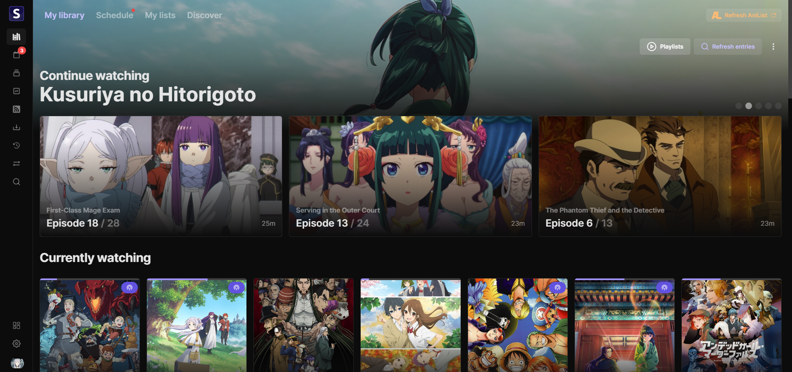
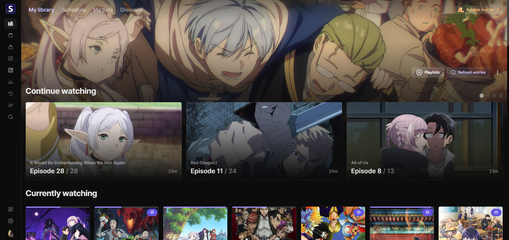
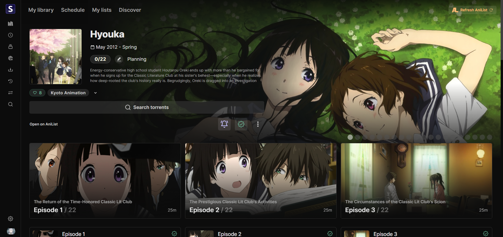
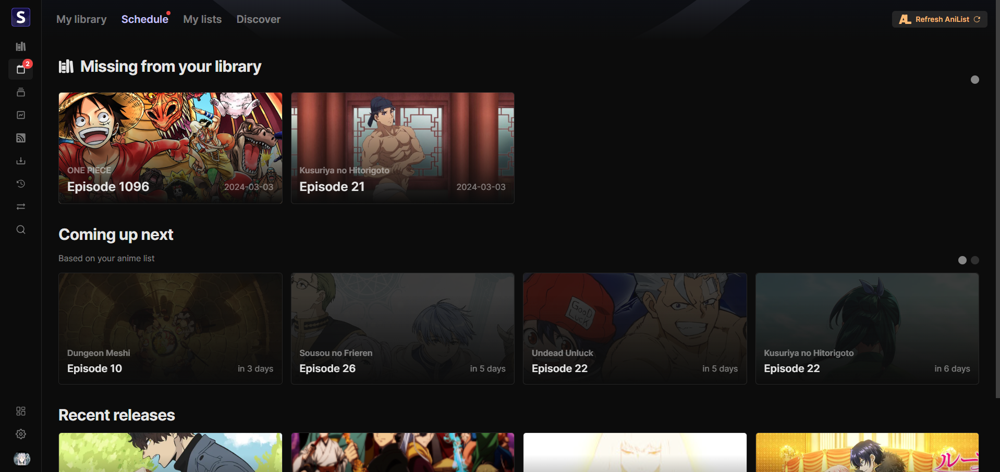

<h2 align="center"><b>Seanime</b></h2>

<h4 align="center">Simple, feature-packed media server for your local anime library.</h4>

<h1 align="center">

</h1>

Feel free to open issues or contribute. Leave a star if you like this project!

# Features

- **User-friendly web interface**
  - Set up Seanime with a few clicks
  - Modern, simple, responsive UI
- **Seamless integration with AniList**
  - Manage your AniList collection (add, update, delete entries)
  - Discover new anime, track your progress, see upcoming episodes, and get recommendations
- **Powerful scanner**
  - No mandatory folder structure or naming convention
  - Support for torrents with absolute episode numbers
- **Download new episodes automatically**
  - Add rules (filters) that specify which torrent to download based on parameters such as release group, resolution, episode numbers
  - Support for Nyaa and AnimeTosho
  - Support for Transmission and qBittorrent
- **Integrated torrent search engine**
  - Manually search and download new episodes with a few clicks without leaving the web interface
- **Third-party media players**
  - Launch an episode from the web interface and Seanime will automatically update your progress on AniList (& MAL)
  - MPV, VLC, and MPC-HC are supported
- **MyAnimeList integration**
  - Sync your anime lists between AniList and MyAnimeList (Experimental)
  - Automatically update your progress on MyAnimeList
- **Online streaming**
  - Stream episodes from online sources directly from the web interface, without any additional setup
- **No data collection**

### Additional features

- Customizable UI
- Playlists for queueing episodes
- Auto scan
- Advanced anime search
- Scan summaries

### What it is not

🚨Seanime is not a replacement for Plex/Jellyfin, it requires an internet connection to fetch metadata and does not
support transcoding or streaming to other devices (yet).

# Setup

[How to use Seanime.](https://seanime.rahim.app/docs)

# Next releases

- [ ] **v1.2.0**
- [x] **v1.1.1** - Sunday, 3/24/2024
- [x] **v1.1.0** - Thursday, 3/21/2024
- [x] **v1.0.0** - Saturday, 3/9/2024
 
### Not planned

- Support for other providers such as Trakt, SIMKL, etc.
- Torrent streaming
- Support for other languages
- Mobile app

## Resources

- [AniList API](https://anilist.gitbook.io/anilist-apiv2-docs)
- [MAL API](https://myanimelist.net/apiconfig/references/api/v2)
- [Chalk UI](https://chalk.rahim.app) - UI library
- [Fiber](https://gofiber.io/) - Web framework
- [GORM](https://gorm.io/) - ORM
- [gqlgenc](https://github.com/Yamashou/gqlgenc) - GraphQL codegen
- [Next.js](https://nextjs.org/) - React framework
- [Tailwind CSS](https://tailwindcss.com/) - CSS framework
- [React Query](https://react-query.tanstack.com/) - Data fetching library
- [Seanime Parser](https://github.com/5rahim/seanime/tree/main/seanime-parser) - Parser for anime files
- [ani.zip](https://api.ani.zip/mappings?anilist_id=124080) - Mappings and episode data

## Acknowledgements

- [Anikki](https://github.com/Kylart/Anikki/) - Inspired GraphQL fragments
- [Lunarr](https://github.com/lunarr-app/lunarr-go/) - Inspired the use of GORM
- [Mangal](https://github.com/metafates/mangal) - Release note script

# Screenshots

<h1 align="center">

</h1>

# Disclaimer

- Seanime relies exclusively on the content stored by individual users on their personal devices. 
The acquisition and legitimacy of this content are external to the developer's control.
- Seanime and its developer do not host, store, or distribute any content found within the application. All anime
  information, as well as images, are sourced from publicly available APIs such as AniList and MyAnimeList.
- Seanime may, at its discretion, provide links or an interface to external websites or applications. These external websites are independently maintained by third parties, and Seanime has no control
  over the legitimacy of their content or operations. Please contact the website's owners for any concerns.
- Seanime does not collect any kind of personal data or information from its users. You are responsible for maintaining the privacy and security of the third-party authentication tokens stored within your device.
