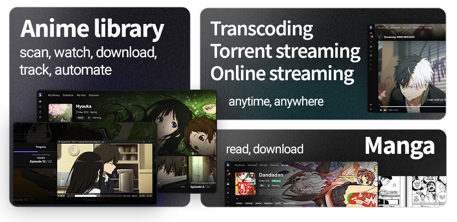

<h1 align="center"><b>Seanime</b></h1>

<h4 align="center">
Self-hosted anime and manga server for sea rovers.
</h4>

Scan, watch, automate, stream your anime collection, read manga, track your progress and more - all in one place.

  <a href="https://seanime.rahim.app/docs">Documentation</a> |
  <a href="https://github.com/5rahim/seanime/releases">Latest release</a> |
  <a href="#screenshots">Screenshots</a>

## About

Seanime is a free and open-source media server built around AniList and other anime APIs to provide a seamless experience for anime and manga enthusiasts. 
It combines a lightweight server with a user-friendly web interface to manage and consume your local anime library, download new episodes, find new shows, read and download manga chapters, and more.

Feel free to open issues or contribute. Leave a star if you like this project!

# Features

### All-in-one

- 🪶 Lightweight, cross-platform and performant server
- 🔥 Simple and modern and customizable web interface
- 🌐 Automatic progress tracking and full integration with AniList
- 🔒 No data collection
- ✈️ **Offline mode**
  - Use the main features as if you were online, with cached metadata and images
  - Track your progress and manage your lists offline and sync when you’re back online

### 🗂️ Scan your anime library
- Scan and browse your local anime collection with ease, **no mandatory folder structure** and **no naming conventions** required
- Powerful parser for anime filenames, automatic metadata handling for episodes, movies, OVAs, specials, etc.
- Multiple metadata sources (AniList, AniDB, TheTVDB)

### ⬇️ Download new episodes & movies

- Integrated **search engine** for public trackers (AnimeTosho, Nyaa, Nyaa Sukebei) with SeaDex support
- Integration with **qBittorrent** & **Transmission** for a seamless download experience
- View upcoming and missing episodes to never miss a release
- **Automate everything** by creating custom rules and let Seanime download new episodes or movies for you

### 🎞️ Watch, anytime, anywhere
- **MPV**, **VLC**, and **MPC-HC** support for local media playback and progress tracking
- Create **playlists** to binge-watch seamlessly

#### 📱 Transcoding (Experimental)
- Watch your downloaded episodes on any device with a web browser
- On-the-fly transcoding with seeking support powered by **FFmpeg**
- Support for hardware acceleration (NVIDIA NVENC, Intel QSV, VAAPI)
- Built-in player with subtitle support

#### 📽️ Torrent streaming (Experimental)
- Stream torrents directly to your media player without waiting for the download to complete
- Automatic torrent selection with no input required - click and play
- Auto-selection of single episodes from batches
- Support for seeding in the background after streaming

#### 📺 Online streaming
  - Watch episodes from online sources using the built-in player
  - Support for multiple sources

### 📕 Browse and manage your manga collection
  - Browse your AniList manga collection, search for new manga, get recommendations
- **Read chapters** from various sources with the built-in, customizable manga reader
- **Download chapters** for offline reading

### Other features
- **Advanced anime/manga search**
- **Discord Rich Presence**
- **MyAnimeList integration** for syncing progress
- **Logs and scan summaries**

# Get started

Read the installation guide to set up Seanime on your device.

<a href="https://seanime.rahim.app/docs" style="font-size:18px;" align="center">
How to install Seanime
</a>

 
### Not planned

- Support for other providers such as Trakt, SIMKL, etc.
- Support for other languages
- Mobile app

## Development and Build

To get started, you will need to be familiar with Go and React.

[Read more here](https://github.com/5rahim/seanime/blob/main/DEVELOPMENT_AND_BUILD.md)

# Screenshots

View more

## Disclaimer

- Seanime relies exclusively on the content stored by individual users on their personal devices. 
The acquisition and legitimacy of this content are external to the developer's control.
- Seanime and its developer do not host, store, or distribute any content found within the application. All anime
  information, as well as images, are sourced from publicly available APIs such as AniList and MyAnimeList.
- Seanime may, at its discretion, provide links or an interface to external websites or applications. These external websites are independently maintained by third parties, and Seanime has no control
  over the legitimacy of their content or operations. Please contact the website's owners for any concerns.
- Seanime does not collect any kind of personal data or information from its users. You are responsible for maintaining the privacy and security of the third-party authentication tokens stored within your device.

## Stargazers

