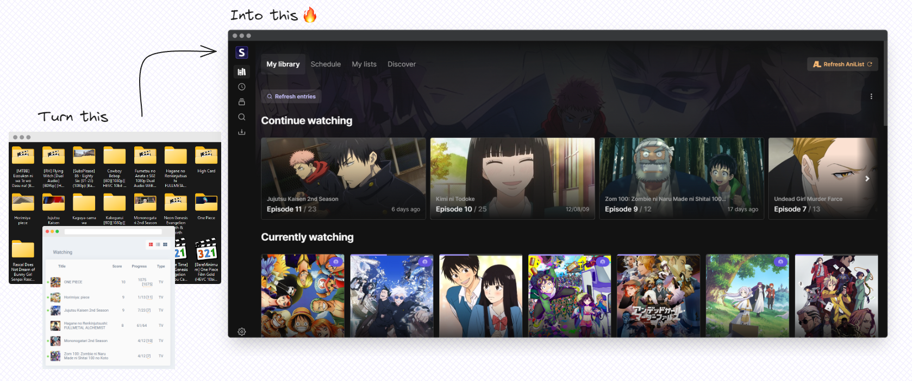
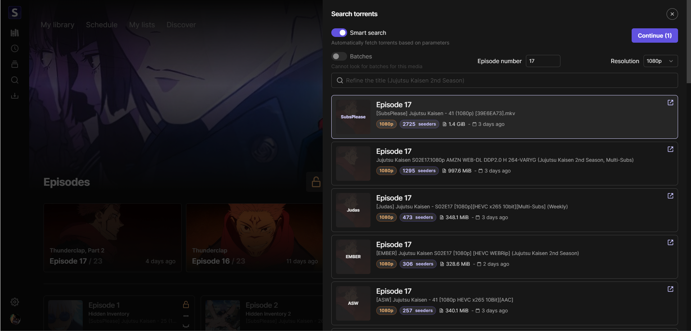
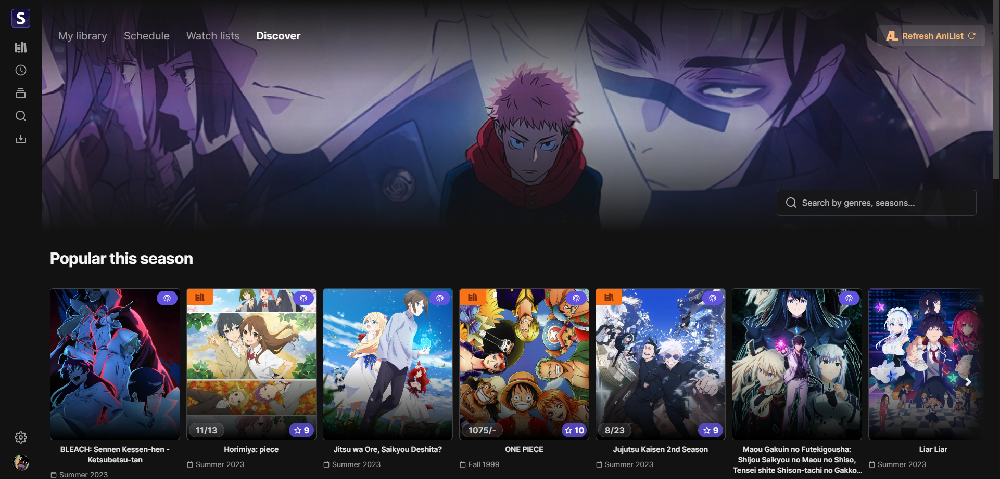

<p align="center">

</p>

<h2 align="center"><b>Seanime Server</b></h2>

<h4 align="center">User-friendly, self-hosted server that brings you a Netflix-like experience for your local
anime library.</h4>



# Features

Here are the main features of Seanime Server:

- One-step scan of your anime library.
- User-friendly web interface.
- Seamless integration with AniList.
- Scanner that automatically match local files with corresponding anime.
- No mandatory folder structure / No need for renaming.
- Support for torrents with absolute episode numbers.
- Integrated torrent search engine with Nyaa and qBittorrent integration to download new episodes.
- Automatically update your progress on AniList when you watch an episode using VLC or MPC-HC.

### What it is not

Seanime Server is not a replacement for Plex/Jellyfin as it is not meant to be a fully-fledged media server.
It demands an internet connection to fetch metadata.

### TODO

- Add support for automatic syncing with MyAnimeList & Kitsu.
- Add support for deleting files.

# Development

### Web interface

[Repository](https://github.com/5rahim/seanime-web)

### GraphQL Codegen

```bash
go get github.com/Yamashou/gqlgenc
cd internal/anilist
go run github.com/Yamashou/gqlgenc
cd ../..
go mod tidy
```

### Tests

Some tests require mock data to be generated first in the `test/sample` folder.

```text
anilist_collection.json
filepaths.json
jwt.json
localfiles.json
localfiles_selected.json
media.json
```

## Acknowledgements

- [Anikki](https://github.com/Kylart/Anikki/) - Inspired GraphQL fragments
- [Lunarr](https://github.com/lunarr-app/lunarr-go/) - Inspired the use of GORM

# Screenshots

## Library


## View


## Torrent search & download



## Discover



## Schedule


## Progress tracking

