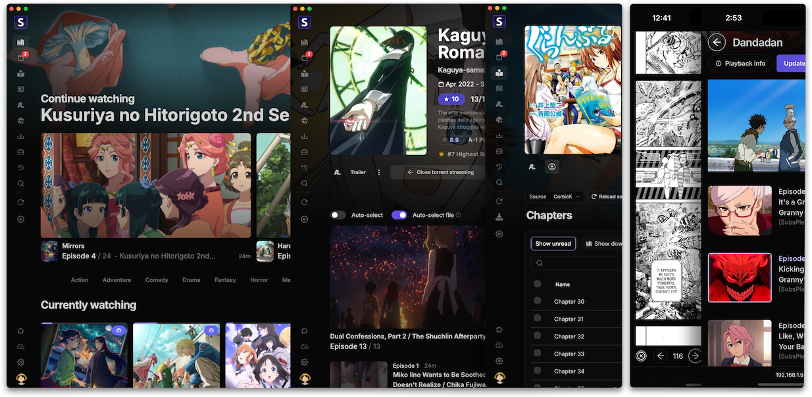
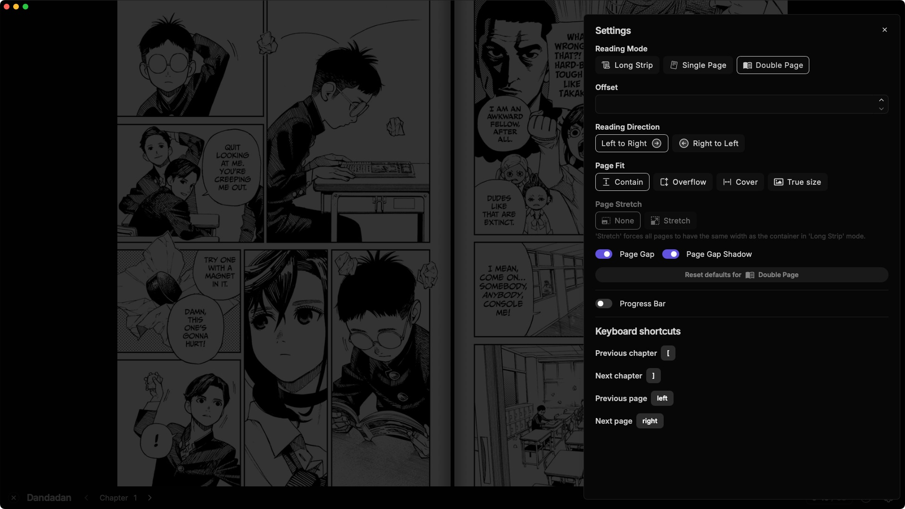
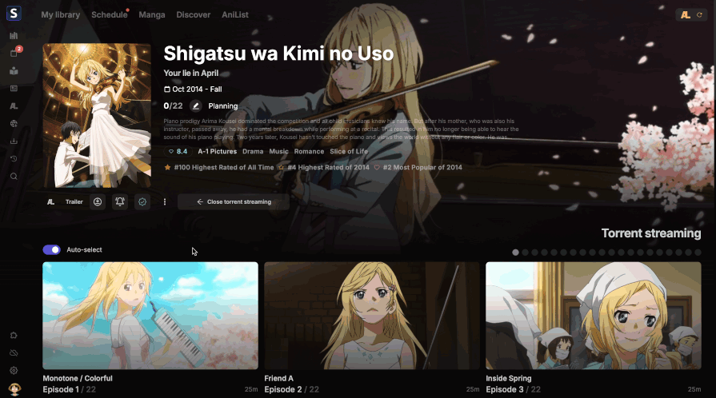
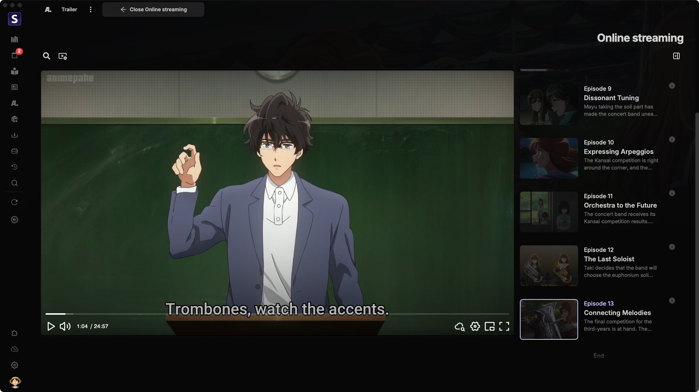
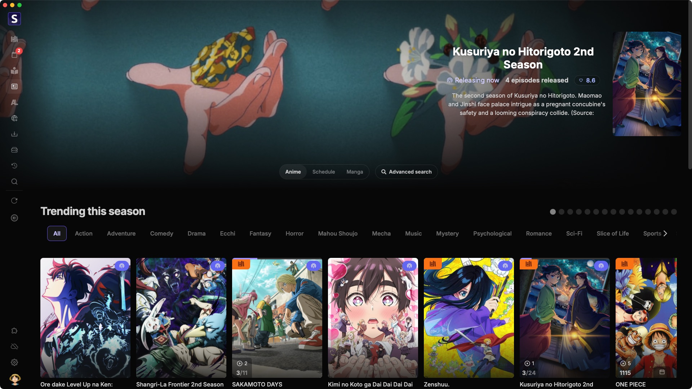
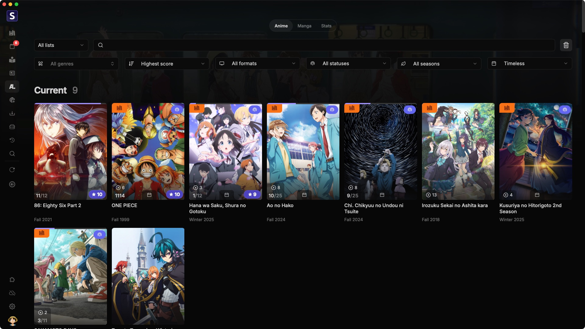

<h1 align="center"><b>Seanime</b></h1>

  <a href="https://seanime.rahim.app/docs">Documentation</a> |
  <a href="https://github.com/5rahim/seanime/releases">Latest release</a> |
  <a href="#screenshots">Screenshots</a> |
  <a href="https://www.youtube.com/playlist?list=PLgQO-Ih6JClhFFdEVuNQJejyX_8iH82gl">Tutorials</a> |
  <a href="https://discord.gg/Sbr7Phzt6m">Discord</a>

  
  
  

<h5 align="center">
Leave a star if you like the project! ⭐️
</h5>

## About

Seanime is a **media server** with a **web interface** and **desktop app** for watching anime, managing your local library, and reading manga.

## Features

- Cross-platform web interface and desktop app
- Complete AniList integration (browse, manage, score, discover, etc.)
- Offline mode for both anime and manga
- Scan your local library in seconds, no renaming needed
- Integrated torrent search engine
- Stream torrents directly to your media player without downloading using Bittorrent, Torbox and Real-Debrid
- Support for qBittorrent, Transmission, Torbox and Real-Debrid for downloading
- Auto-downloading for new episodes with custom filters
- MPV, VLC, MPC-HC, and mobile player app support for watching
- Transcoding and direct play for streaming to any device web browser
- Online streaming with support for multiple web sources & extensions
- Read and download manga chapters with support for multiple sources & extensions
- Extension system for adding new sources
- Schedule for tracking upcoming or missed episodes
- Customizable UI
- And more

## Get started

Read the installation guide to set up Seanime on your device.

<a href="https://seanime.rahim.app/docs/getting-started" style="font-size:18px;" align="center">
How to install Seanime
</a>

## Goal

This is a one-person project and may not meet every use case. If it doesn’t fully fit your needs, other tools might be a better match.

### Not planned

- Support for other providers such as Trakt, SIMKL, etc.
- Support for other media players
- Dedicated clients (TV, mobile, etc.)
- Support for other languages (translations)

Consider sponsoring or sharing the project if you want to see more features implemented.

## Sponsors

The maintenance of this project is made possible by the sponsors.

<!-- real-sponsors --><!-- real-sponsors -->
<!-- real-sponsors --><!-- real-sponsors -->

## Development and Build

Building from source is straightforward, you'll need Node.js and Go installed on your system.
Development and testing might require additional configuration.

[Read more here](https://github.com/5rahim/seanime/blob/main/DEVELOPMENT_AND_BUILD.md)

## Screenshots

### Scanning

### Watching

### Downloading

### Manga

### Torrent streaming

### Debrid streaming

<b>View more</b>

### Online streaming

### Discover

### AniList integration

## Disclaimer

Seanime and its developer do not host, store, or distribute any content found within the application. All content metadata, including images, are sourced from publicly available APIs such as AniList, AniDB and TheTVDB.
Furthermore, Seanime does not endorse or promote piracy in any form. It is the user's responsibility to ensure that they are in compliance with their local laws and regulations.
