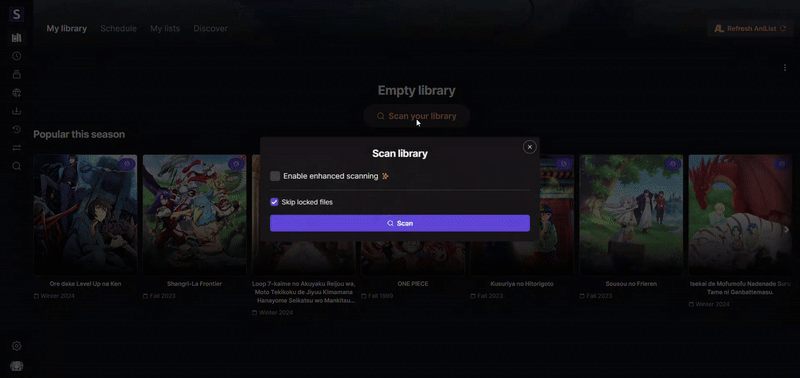
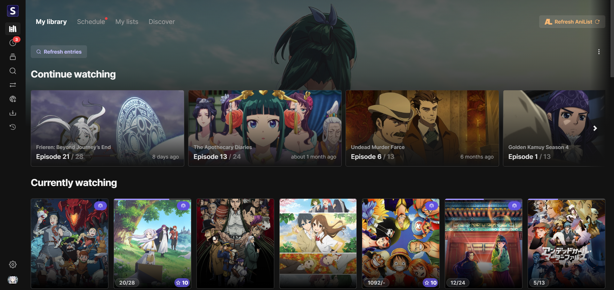
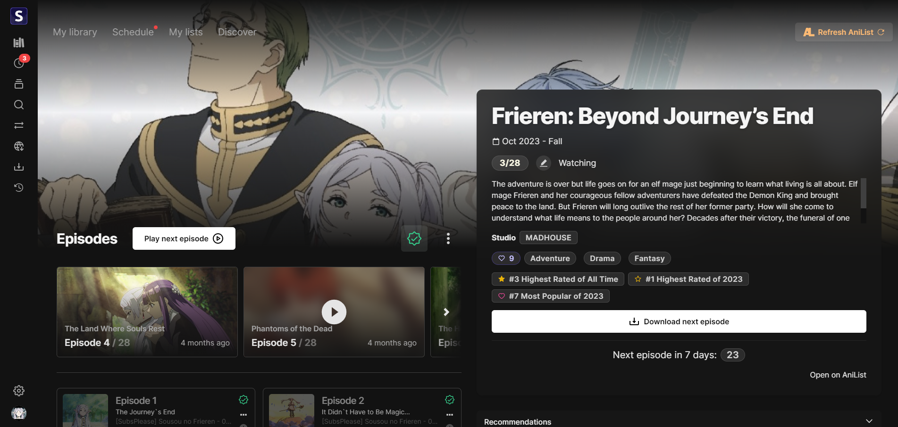
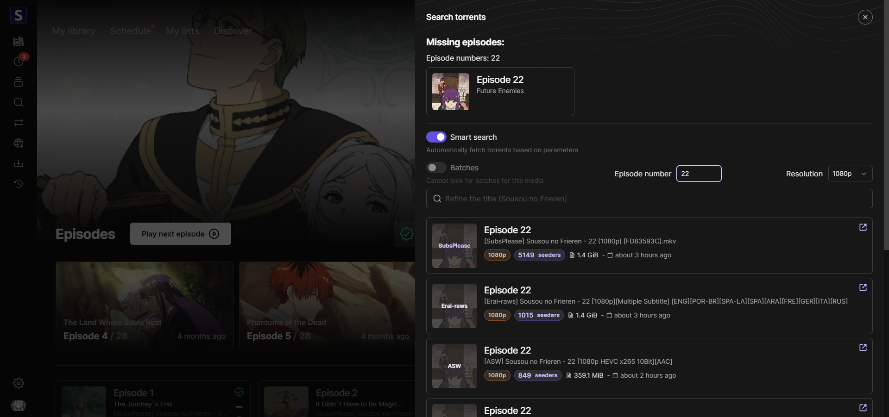
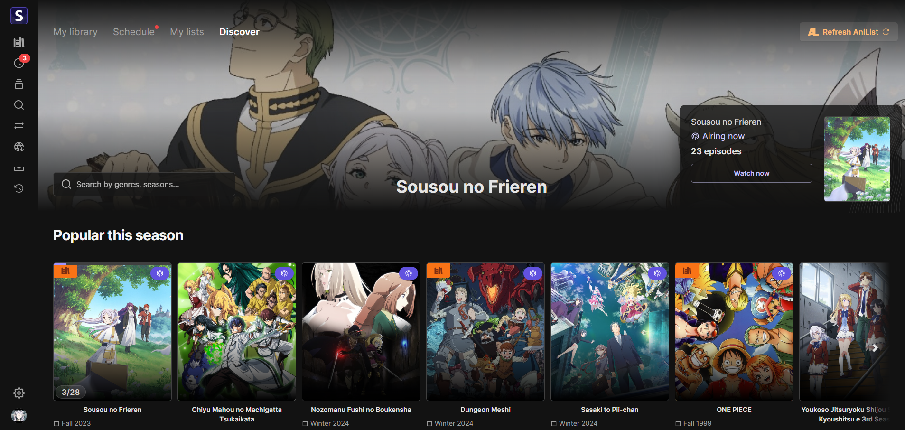
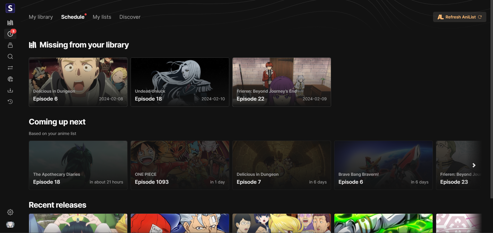

<h2 align="center"><b>Seanime</b></h2>

<h4 align="center">User-friendly, self-hosted server that brings you a Netflix-like experience for your local
anime library.</h4>

<h1 align="center">

</h1>

Feel free to fork the project, contribute or open issues. Leave a star if you like this project!

# Features

- ✨ **User-friendly web interface**
  - Set up Seanime with a few clicks
  - Netflix-like experience for your local anime library
- ✨ **Seamless integration with AniList**
  - Manage your AniList collection
- 🎉 **Automatically scan your anime library**
  - Seanime does not require a mandatory folder structure or naming convention
  - Seanime supports torrent names with absolute episode numbers
- 🎉 **Download new episodes automatically**
  - Add rules (filters) that specify which torrent to download based on parameters such as release group, resolution, episode numbers
  - Seanime will check RSS feeds for new episodes and download them automatically via qBittorrent
- 🎉 **Integrated torrent search engine**
  - You can manually search and download new episodes with a few clicks
  - Seanime will notify you when new episodes are available
- 🎉 **Automatically track your progress**
  - Launch an episode from the web interface and Seanime will automatically update your progress on AniList
- 🎉 **MyAnimeList integration**
  - Sync your anime lists between AniList and MyAnimeList (Experimental)
  - Automatically update your progress on MyAnimeList
- **No data collection**

### What it is not

🚨Seanime is not a replacement for Plex/Jellyfin, it requires an internet connection to fetch metadata and does not
support transcoding or streaming to other devices (yet).

# Setup

[How to use Seanime.](https://seanime.rahim.app/docs)

## Resources

- AniList API
- [Conc](https://github.com/sourcegraph/conc)
- [Fiber](https://gofiber.io/) - Web framework
- [GORM](https://gorm.io/) - ORM
- [gqlgenc](github.com/Yamashou/gqlgenc) - GraphQL codegen
- [Next.js](https://nextjs.org/) - React framework
- [Tailwind CSS](https://tailwindcss.com/) - CSS framework
- [React Query](https://react-query.tanstack.com/) - Data fetching
- [Chalk UI](https://chalk.rahim.app) - UI components
- Seanime Parser - Pure Go parser for anime filenames
- MAL API

## Acknowledgements

- [Anikki](https://github.com/Kylart/Anikki/) - Inspired GraphQL fragments
- [Lunarr](https://github.com/lunarr-app/lunarr-go/) - Inspired the use of GORM
- [Mangal](https://github.com/metafates/mangal) - Release note script

# Screenshots

<h1 align="center">

</h1>

## Library

## Anime Entry

## Torrent search & download

## Discover

## Schedule

