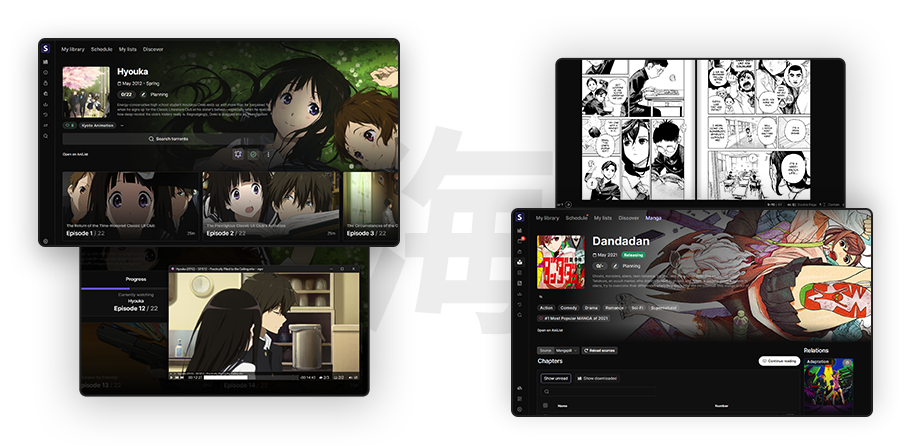
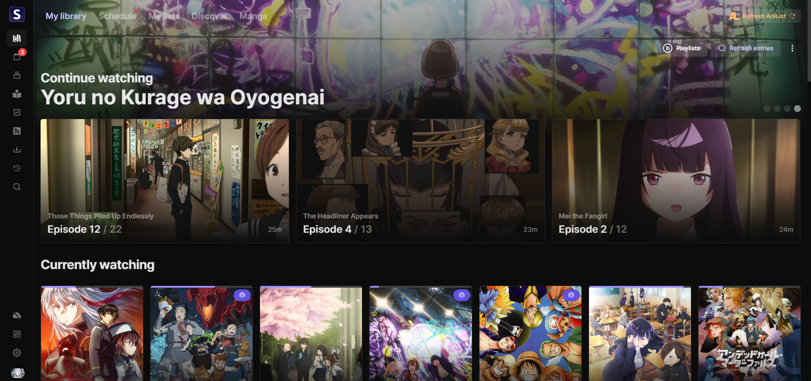
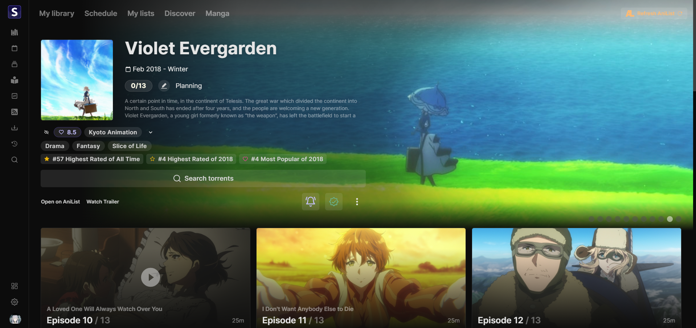
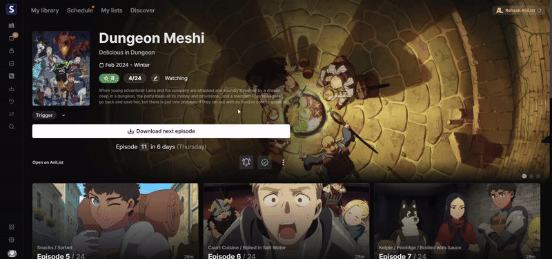
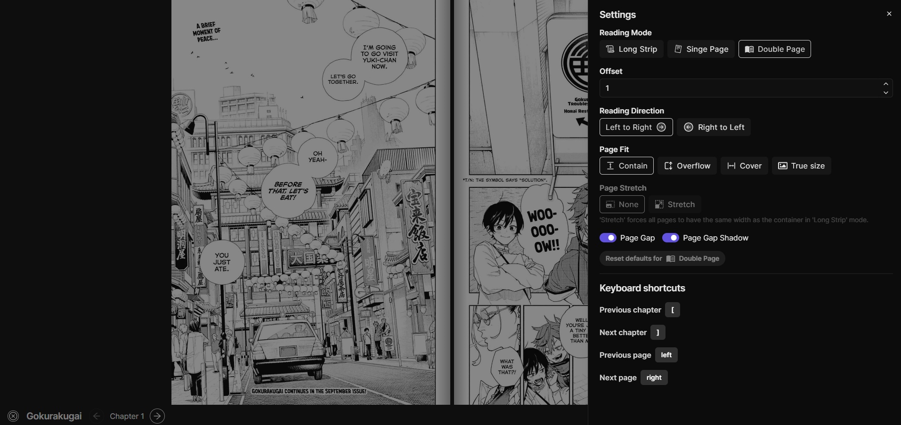
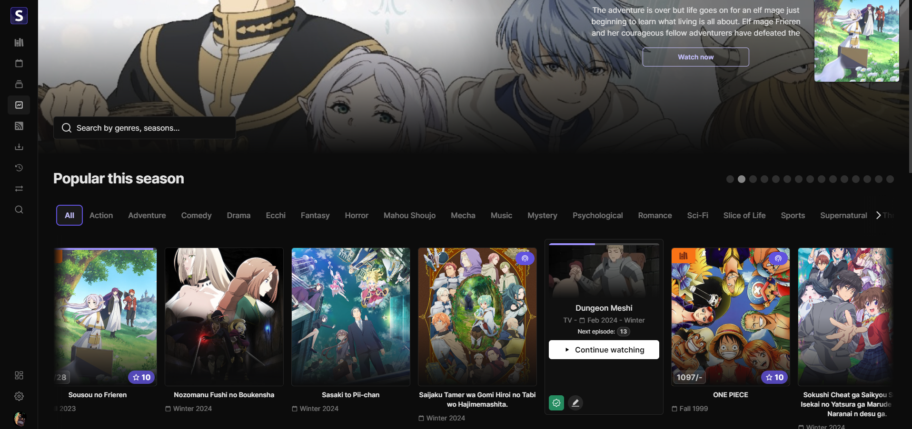
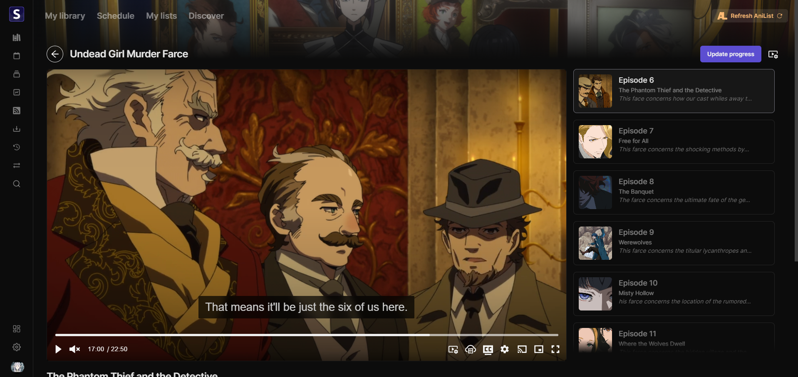

<h1 align="center"><b>Seanime</b></h1>

<h4 align="center">
Self-hosted anime and manga server for sea rovers.
</h4>

Scan, automate and enjoy your anime collection, read manga, track your progress and more - all in one place.

  <a href="#anime">Anime features</a> •
  <a href="#manga--manhwa">Manga features</a> •
  <a href="https://seanime.rahim.app/docs">Documentation</a> •
  <a href="https://github.com/5rahim/seanime/releases">Latest release</a> •
  <a href="#screenshots">Screenshots</a>

## About

Seanime is a free and open-source media server built around AniList and other anime APIs to provide a seamless experience for anime and manga enthusiasts. 
It combines a lightweight server with a user-friendly web interface to manage and consume your local anime library, download new episodes, find new shows, read and download manga chapters, and more.

Feel free to open issues or contribute. Leave a star if you like this project!

# Features

### General

- 🪶 Lightweight and performant server
- 🔥 Simple and intuitive web interface
- 🖥️ Cross-platform (Windows, macOS, Linux)
- 🌐 Full integration with AniList
- 🔒 No data collection
- ✈️ **Offline mode**
  - Use the main features as if you were online, with cached metadata and images
  - Track your progress and manage your lists offline and sync when you’re back online

### Anime

- 🗂️ **Local anime library**
  - Powerful library scanner
  -  **No mandatory folder structure** and **no naming conventions**
  - Browse and manage your library with metadata
  - Support for torrents with absolute episode numbers
  - Support for specials, OVAs, movies, NCs
  - Multiple metadata providers (AniList, AniDB, TVDB)
- ⬇️ **Download new episodes & movies**
    - Search engine for public trackers (AnimeTosho, Nyaa, Nyaa Sukebei)
    - Integration with **qBittorrent** & **Transmission**
    - Active torrent list interface
    - View upcoming and missing episodes
    - SeaDex support
- 🥱 **Automate your library**
  - Create custom rules and let Seanime download new episodes automatically
  - Rules can filter by quality, release group, episode number
  - Smart and powerful RSS feed parser
- 🎞️ **External Players**
    - **MPV**, **VLC**, and **MPC-HC** support
    - Automatic progress tracking and syncing to AniList (& MAL)
    - Create **playlists** to play episodes in order

### Manga / Manhwa 

- 📕 **Browse and manage** your manga/manhwa collection
  - Browse your AniList manga collection
  - View manga details, and recommendations
  - Search for new manga
- 📖 **Read chapters**
  - Display and read chapters from various sources
  - Built-in, customizable **manga reader**
  - Custom reader settings for different series
- ⬇️ **Download chapters**
  - Easily download multiple chapters for offline reading
  - Persistent download queue

### And more

- 📺 **Online streaming**
  - Stream episodes from online sources using the built-in player
  - Support for multiple sources
- **MyAnimeList integration** for syncing progress
- **Customizable UI**
- **Logs and scan summaries**
- **Advanced anime/manga search**
- **Discord Rich Presence**

### What it is not

🚨Seanime is not a replacement for Plex/Jellyfin, it requires an internet connection to fetch metadata and does not
support transcoding or streaming to other devices (yet).

# Get started

Read the installation guide to set up Seanime on your device.

<a href="https://seanime.rahim.app/docs" style="font-size:18px;" align="center">
How to install Seanime
</a>

 
### Not planned

- Support for other providers such as Trakt, SIMKL, etc.
- Torrent streaming
- Support for other languages
- Mobile app

## Development and Build

To get started, you will need to be familiar with Go and Typescript.

[Read more here](https://github.com/5rahim/seanime/blob/main/DEVELOPMENT_AND_BUILD.md)

## Acknowledgements

- [Anikki](https://github.com/Kylart/Anikki/) - Inspired GraphQL fragments
- [Lunarr](https://github.com/lunarr-app/lunarr-go/) - Inspired the use of GORM
- [Mangal](https://github.com/metafates/mangal) - Release note script

# Screenshots

# Disclaimer

- Seanime relies exclusively on the content stored by individual users on their personal devices. 
The acquisition and legitimacy of this content are external to the developer's control.
- Seanime and its developer do not host, store, or distribute any content found within the application. All anime
  information, as well as images, are sourced from publicly available APIs such as AniList and MyAnimeList.
- Seanime may, at its discretion, provide links or an interface to external websites or applications. These external websites are independently maintained by third parties, and Seanime has no control
  over the legitimacy of their content or operations. Please contact the website's owners for any concerns.
- Seanime does not collect any kind of personal data or information from its users. You are responsible for maintaining the privacy and security of the third-party authentication tokens stored within your device.
