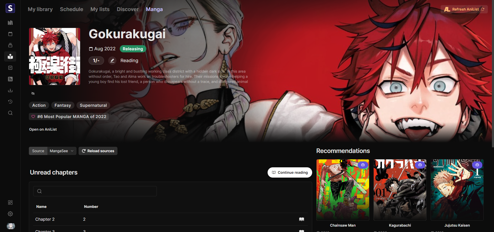

<h2 align="center"><b>Seanime</b></h2>

<h4 align="center">Self-hosted, user-friendly media server for anime and manga enthusiasts.</h4>

<h1 align="center">

</h1>

Feel free to open issues or contribute. Leave a star if you like this project!

# Features

### Server + Web Interface

- 🪶 **Lightweight server**
  - Low resource usage
  - Performant and responsive
- 🖥️ **Cross-platform**
  - Works on Windows, macOS, and Linux 
- 🔥 **User-friendly**
  - Simple and intuitive web interface
  - Easy to set up and use 
- 🌐 **Seamless integration with AniList**
  - Manage your AniList collection (anime and manga)
  - Discover new anime, browse entries, get recommendations
- 🔒 **No data collection**

### Anime

- 🏞️ **Local anime library**
  - **Scan** your local anime library effortlessly
  -  **No mandatory folder structure** or naming convention
  - Browse and manage your library with metadata
  - Support for torrents with absolute episode numbers
- ⬇️ **Download new episodes & movies**
    - Smart search engine powered by public trackers (AnimeTosho, Nyaa), SeaDex
    - Integration with **qBittorrent** & **Transmission**
- 🥱 **Automate your library**
  - Download new episodes automatically with the use of custom filters
- 🎞️ **External Players**
    - **MPV**, **VLC**, and **MPC-HC** support
    - Sync progress to AniList (& MAL) automatically
    - Create **playlists** and queue episodes

### Manga / Manhwa 

- 📖 **Read chapters** from various sources
  - Built-in, customizable **reader**
- 📕 **Browse and manage** your AniList manga/manhwa collection

### And more

- 📺 **Online streaming**
  - Stream episodes from online sources using the built-in player
  - Support for multiple sources
- **MyAnimeList integration**
  - Automatically update your progress on MyAnimeList
- **Quality of life features**
  - Customizable UI, Scan summaries, advanced anime search, and more

### What it is not

🚨Seanime is not a replacement for Plex/Jellyfin, it requires an internet connection to fetch metadata and does not
support transcoding or streaming to other devices (yet).

# Setup

[How to use Seanime.](https://seanime.rahim.app/docs)

# Next releases

- [ ] **v1.4.0** - Friday, 4/19/2024
- [x] **v1.3.0** - Saturday, 4/6/2024
- [x] **v1.2.0** - Monday, 4/1/2024
- [x] **v1.1.2** - Sunday, 3/24/2024
- [x] **v1.1.1** - Sunday, 3/24/2024
- [x] **v1.1.0** - Thursday, 3/21/2024
- [x] **v1.0.0** - Saturday, 3/9/2024
 
### Not planned

- Support for other providers such as Trakt, SIMKL, etc.
- Torrent streaming
- Support for other languages
- Mobile app

## Resources

- [AniList API](https://anilist.gitbook.io/anilist-apiv2-docs)
- [MAL API](https://myanimelist.net/apiconfig/references/api/v2)
- [Chalk UI](https://chalk.rahim.app) - UI library
- [Fiber](https://gofiber.io/) - Web framework
- [GORM](https://gorm.io/) - ORM
- [gqlgenc](https://github.com/Yamashou/gqlgenc) - GraphQL codegen
- [Next.js](https://nextjs.org/) - React framework
- [Tailwind CSS](https://tailwindcss.com/) - CSS framework
- [React Query](https://react-query.tanstack.com/) - Data fetching library
- [Seanime Parser](https://github.com/5rahim/seanime/tree/main/seanime-parser) - Parser for anime files
- [ani.zip](https://api.ani.zip/mappings?anilist_id=124080) - Mappings and episode data
- [anime-lists](https://github.com/Fribb/anime-lists) - Mappings
- [TheTVDB](https://www.thetvdb.com/) - Episode images

## Acknowledgements

- [Anikki](https://github.com/Kylart/Anikki/) - Inspired GraphQL fragments
- [Lunarr](https://github.com/lunarr-app/lunarr-go/) - Inspired the use of GORM
- [Mangal](https://github.com/metafates/mangal) - Release note script

# Screenshots

# Disclaimer

- Seanime relies exclusively on the content stored by individual users on their personal devices. 
The acquisition and legitimacy of this content are external to the developer's control.
- Seanime and its developer do not host, store, or distribute any content found within the application. All anime
  information, as well as images, are sourced from publicly available APIs such as AniList and MyAnimeList.
- Seanime may, at its discretion, provide links or an interface to external websites or applications. These external websites are independently maintained by third parties, and Seanime has no control
  over the legitimacy of their content or operations. Please contact the website's owners for any concerns.
- Seanime does not collect any kind of personal data or information from its users. You are responsible for maintaining the privacy and security of the third-party authentication tokens stored within your device.
