

<h1 align="center"><b>Seanime</b></h1>

<h4 align="center">
Self-hosted anime and manga server for sea rovers.
</h4>

Scan, watch, automate, stream your anime collection, read manga, track your progress and more - all in one place.

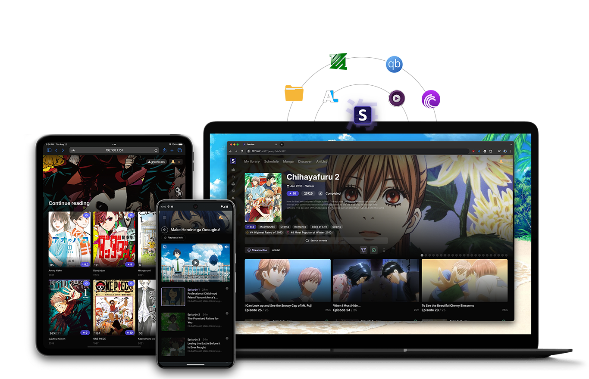

  <a href="https://seanime.rahim.app/docs">Documentation</a> |
  <a href="https://github.com/5rahim/seanime/releases">Latest release</a> |
  <a href="#screenshots">Screenshots</a> |
  <a href="https://discord.gg/Sbr7Phzt6m">Discord</a>

## About

Seanime is a free and open-source media server built around APIs to provide a seamless experience for anime and manga enthusiasts. 
It combines a lightweight server and a user-friendly web interface to manage and consume your local anime library, download new episodes, find new shows, read and download manga chapters, and more.

Feel free to open issues if you notice any bugs, open discussions if you have questions, or contribute to the project if you want to help make it better.

# Get started

Read the installation guide to set up Seanime on your device.

<a href="https://seanime.rahim.app/docs" style="font-size:18px;" align="center">
How to install Seanime
</a>

<h5 align="center">
Leave a star if you like the project! ⭐️
</h5>

# Features

### All-in-one

- 🪶 Lightweight, cross-platform and performant server
- 🔥 Simple, modern and customizable web interface
- 🌐 Automatic progress tracking and full integration with AniList
- 🔒 No data collection
- ✈️ **Offline mode**
  - Use the main features as if you were online, with cached metadata and images
  - Track your progress and manage your lists offline and sync when you’re back online

### 🗂️ Scan your anime library
- Scan and browse your local anime collection with ease, **no mandatory folder structure** and **no naming conventions** required
- Powerful parser for anime filenames, automatic metadata handling for episodes, movies, OVAs, specials, etc.
- Multiple metadata sources (AniList, AniDB, TheTVDB)

### ⬇️ Download new episodes & movies

- Integrated **search engine** for public trackers (AnimeTosho, Nyaa, Nyaa Sukebei, SeaDex)
- Support for **qBittorrent** & **Transmission** for a seamless downloading experience
- Support for Torbox's debrid service for downloading torrents without the need for a VPN
- View upcoming and missing episodes to never miss a release
- Let Seanime **automatically download** new episodes or movies for you by creating custom rules
- Support for extensions to add more sources

### 🎞️ Watch, anytime, anywhere
- **MPV**, **VLC**, and **MPC-HC** support for local media playback and progress tracking
- Create **playlists** to binge-watch seamlessly
- Support for **mobile app players** (Outplayer, MX Player, etc.) using custom scheme links

### 📱 Media streaming / Transcoding
- Watch your downloaded episodes on any device
- Built-in player with **on-the-fly transcoding** powered by **FFmpeg** & **Direct Play**
- Support for hardware acceleration (NVIDIA NVENC, Intel QSV, VAAPI)

### 📽️ Torrent & Debrid streaming
- Stream torrents directly to your media player (desktop or mobile) without waiting for the download to complete
- Automatic torrent selection with no input required - click and play
- Auto-selection or manual selection of files from batches
- Support for Torbox's debrid service for streaming torrents directly to your media player (desktop or mobile)
without the need for a VPN.

### 📽️ Debrid streaming

### 📺 Online streaming
- Watch episodes from online sources using the built-in player
- Support for multiple sources & extensions

### 📕 Browse and manage your manga collection
- Browse your AniList manga collection, search for new manga, get recommendations
- **Read chapters** from various sources with the built-in, customizable manga reader
- **Download chapters** for offline reading
- Support for extensions to add more sources

### Other features
- **Extension system**
- **Advanced anime/manga search**
- **Discord Rich Presence**
- **Logs and scan summaries**

## Philosophy

The main goal of Seanime is to provide an all-in-one, easy-to-use alternative to traditional media servers like Plex and Jellyfin, designed specifically for anime and manga.
Seanime eliminates the need for setting up and maintaining multiple tools and services (no need for organizing, renaming, setting up plugins, etc.).
As someone who is new to the self-hosting world, I recognize the need for something that is user-friendly, feature-rich, and just works out of the box.
Note that unlike other media servers, Seanime does not _natively_ run on all clients that seasoned self-hosting enjoyers might be used to (dedicated apps etc.), and it
might have some rough edges in some use cases. 

🚨 **Important note**: Remember that this is a one-man project. Seanime is not meant to fulfill all the needs of every user, as such, your specific use case or scenarios might not be supported, and that's okay.
Feel free to turn to other tools or services that better suit your needs.

### Not planned

- Support for other providers such as Trakt, SIMKL, etc.
- Support for other media players
- Dedicated clients (TV, mobile, etc.)
- Support for Usenet, private trackers
- Support for other languages (internationalization)

These features will not be implemented, mainly due to the scope of the project, time required or lack of resources.

## Development and Build

Building from source is straightforward, you'll need Node.js and Go installed on your system.
Development and testing might require additional configuration.

[Read more here](https://github.com/5rahim/seanime/blob/main/DEVELOPMENT_AND_BUILD.md)

# Screenshots

### Scanning

### Progress tracking

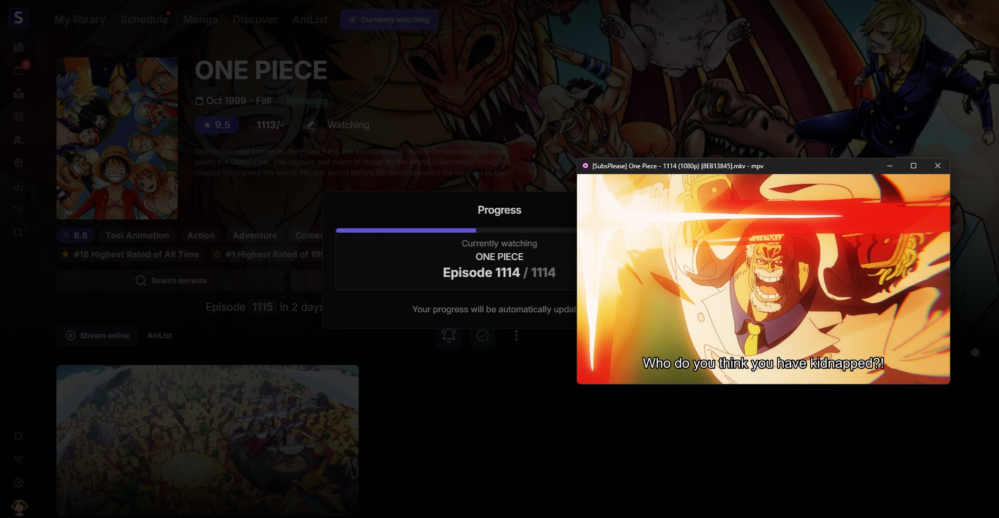

### Downloading

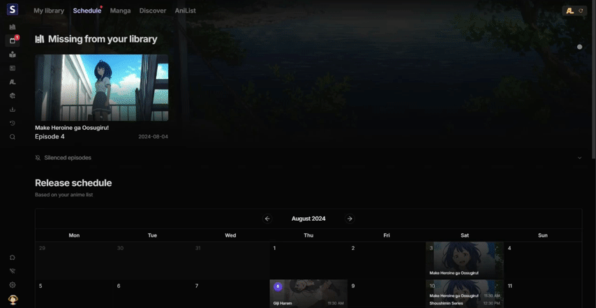

### Manga

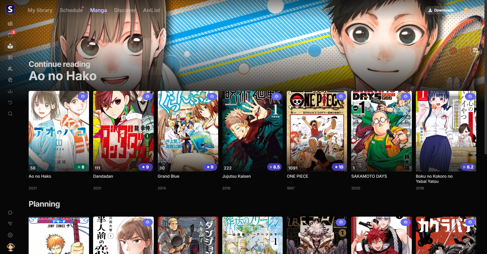
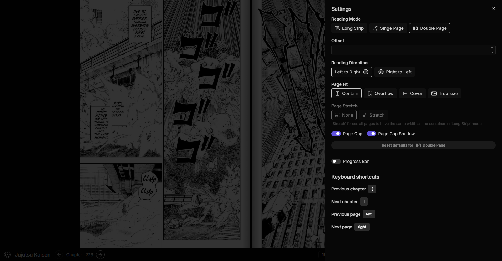

### Torrent streaming

### Media streaming / Transcoding

### Schedule

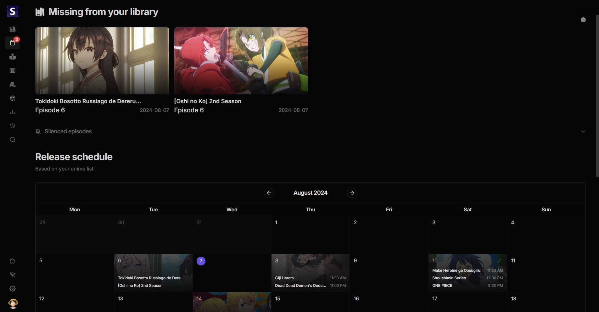

<b>View more</b>

### Online streaming

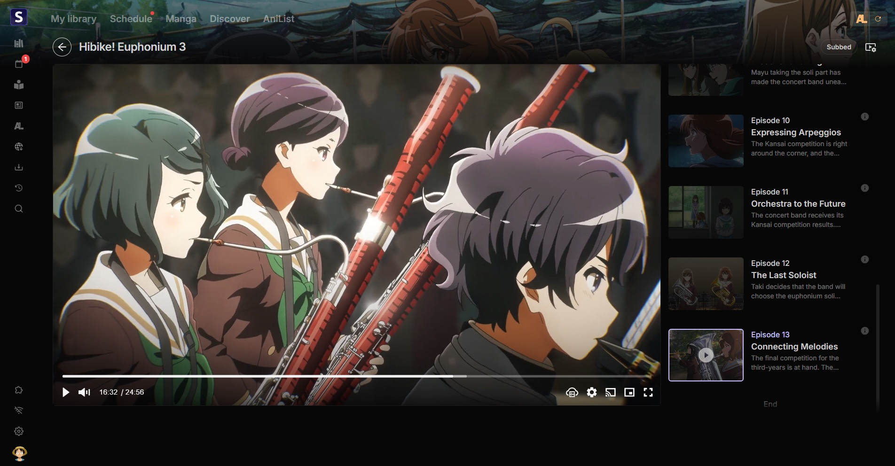

### Detailed library view

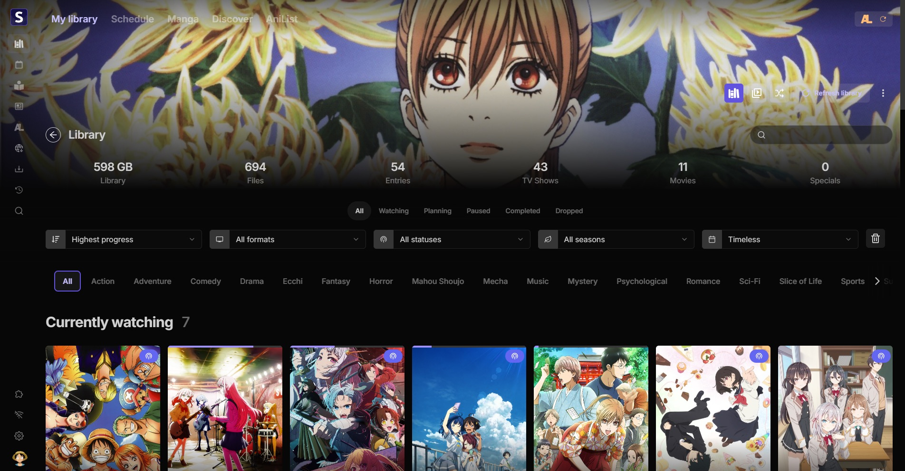

### Discover

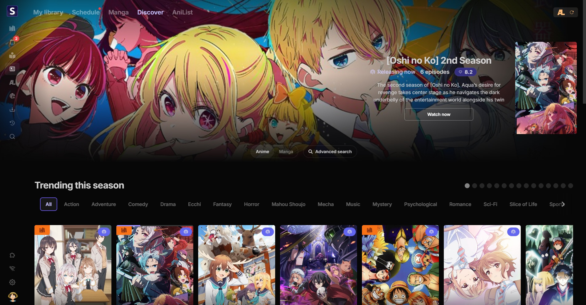
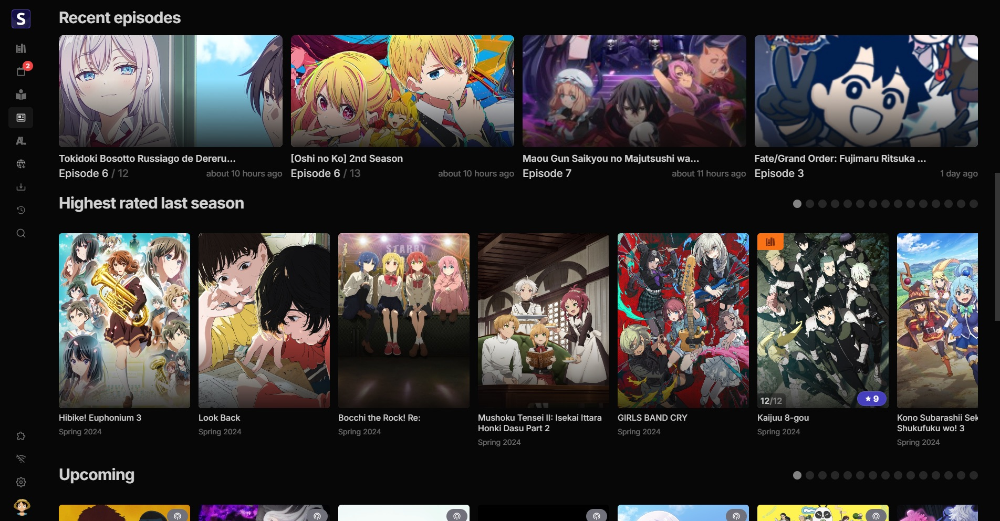

### AniList integration

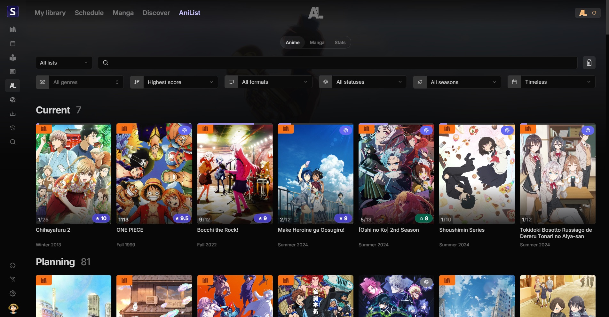

### UI customization

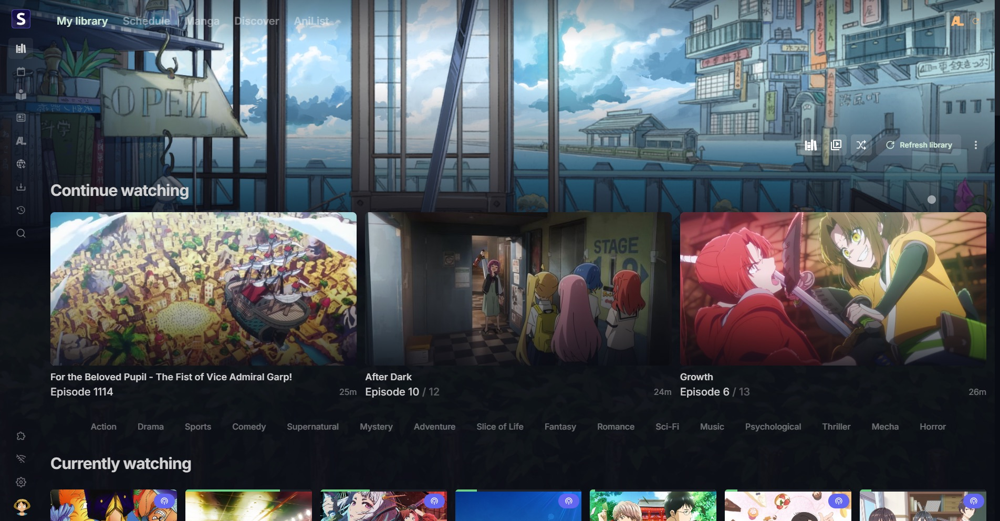

## Disclaimer

- Seanime relies exclusively on the content stored by individual users on their personal devices. 
The acquisition and legitimacy of this content are external to the developer's control.
- Seanime and its developer do not host, store, or distribute any content found within the application. All anime
  information, as well as images, are sourced from publicly available APIs such as AniList and MyAnimeList.
- Seanime may, at its discretion, provide links or an interface to external websites or applications. These external websites are independently maintained by third parties, and Seanime has no control
  over the legitimacy of their content or operations. Please contact the website's owners for any concerns.
- Seanime does not collect any kind of personal data or information from its users. You are responsible for maintaining the privacy and security of the third-party authentication tokens stored within your device.
