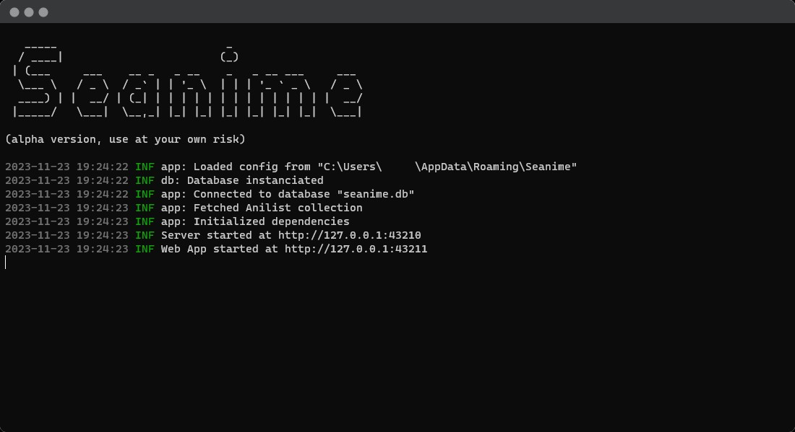
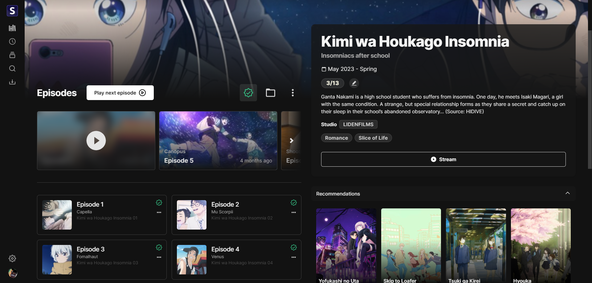

<p align="center">

</p>

<h2 align="center"><b>Seanime</b></h2>

<h4 align="center">User-friendly, self-hosted server that brings you a Netflix-like experience for your local
anime library.</h4>


🚨 This project is a hobby, it's not meant to fix every shortcoming or include every requested feature. Some features
might not work as intended. Feel free to fork the project, contribute or open issues.

# Features

- One-step scan of your anime library.
- User-friendly web interface.
- Seamless integration with AniList.
- Scanner that automatically match local files with corresponding anime.
- No mandatory folder structure / No need for renaming.
- Support for torrents with absolute episode numbers.
- Integrated torrent search engine with Nyaa and qBittorrent integration to download new episodes.
- Automatically update your progress on AniList when you watch an episode using VLC or MPC-HC.

### What it is not

Seanime is not a replacement for Plex/Jellyfin, it requires an internet connection to fetch metadata and does not
support transcoding or streaming to other devices.

### TODO

- Add support for automatic syncing with MyAnimeList & Kitsu.
- Scan logging.

# Setup

[How to use Seanime.](https://seanime.rahim.app/getting-started)

# Development

### Web interface

[Repository](https://github.com/5rahim/seanime-web)

### GraphQL Codegen

```bash
go get github.com/Yamashou/gqlgenc
cd internal/anilist
go run github.com/Yamashou/gqlgenc
cd ../..
go mod tidy
```

### Tests

Some tests require mock data to be generated first in the `test/sample` folder.

```text
anilist_collection.json
filepaths.json
jwt.json
localfiles.json
localfiles_selected.json
media.json
```

## Acknowledgements

- [Anitogo](https://github.com/nssteinbrenner/anitogo) - Anime video filename parser. Original version
  of [Tanuki](https://github.com/5rahim/tanuki)
- [Anikki](https://github.com/Kylart/Anikki/) - Inspired GraphQL fragments
- [Lunarr](https://github.com/lunarr-app/lunarr-go/) - Inspired the use of GORM
- [Mangal](https://github.com/metafates/mangal) - Release note script

# Screenshots

<center>

</center>

## Library


## Media page



## Torrent search & download


## Discover


## Schedule


## Progress tracking


