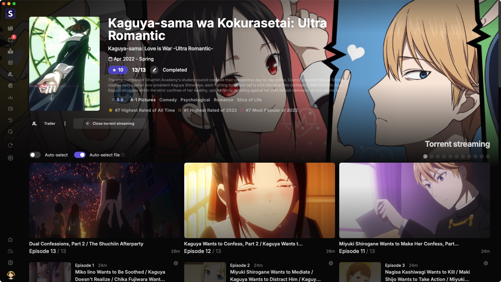

<p align="center">

</p>

<h2 align="center"><b>Seanime Denshi</b></h2>

<p align="center">
Electron-based desktop client for Seanime. Embeds server and web interface. Successor to Seanime Desktop.
</p>

<p align="center">

</p>

---

## Prerequisites

- Go 1.24+
- Node.js 20+ and npm

---

## Seanime Denshi vs Seanime Desktop

Pros:
- Linux support
- Better consistency accross platforms (fewer bugs)
- Built-in player support for torrent/debrid streaming without transcoding

Cons:
- Greater memory usage
- Larger binary size (from ~80mb to ~300mb)

## TODO

- [ ] Built-in player
   - Server: Stream subtitle extraction, thumbnail generation
- [ ] Testing on Windows (Fix titlebar in fullscreen)
- [ ] Fix crash screen
- [ ] Test server reconnection
- [ ] Test updates, auto updates

## Development

### Web Interface

```shell
# Working dir: ./seanime-web
npm run dev:denshi
```
 
### Sidecar

1. Build the server

	```shell
	# Working dir: .
 
	# Windows
	go build -o seanime.exe -trimpath -ldflags="-s -w" -tags=nosystray
 
	# Linux, macOS
	go build -o seanime -trimpath -ldflags="-s -w"
	```
 
2. Move the binary to `./seanime-denshi/binaries`

3. Rename the binary:

   - For Windows: `seanime-server-windows.exe`
   - For macOS/Intel: `seanime-server-darwin-amd64`
   - For macOS/ARM: `seanime-server-darwin-arm64`
   - For Linux/x86_64: `seanime-server-linux-amd64`
   - For Linux/ARM64: `seanime-server-linux-arm64`

### Electron

1. Setup

	```shell
	# Working dir: ./seanime-denshi
	npm install
	```

2. Run

    `TEST_DATADIR` can be used in development mode, it should point to a dummy data directory for testing purposes.

    ```shell
    # Working dir: ./seanime-desktop
    TEST_DATADIR="/path/to/data/dir" npm run dev
   ```

---

## Build

### Web Interface
   
```shell
# Working dir: ./seanime-web
npm run build
npm run build:denshi
```

Move the output `./seanime-web/out` to `./web`
Move the output `./seanime-web/out-denshi` to `./seanime-denshi/web-denshi`

```shell
# UNIX command
mv ./seanime-web/out ./web
mv ./seanime-web/out-denshi ./seanime-denshi/web-denshi
```

### Sidecar

1. Build the server

	```shell
	# Working dir: .
 
	# Windows
	go build -o seanime.exe -trimpath -ldflags="-s -w" -tags=nosystray
 
	# Linux, macOS
	go build -o seanime -trimpath -ldflags="-s -w"
	```
 
2. Move the binary to `./seanime-denshi/binaries`

3. Rename the binary:

   - For Windows: `seanime-server-windows.exe`
   - For macOS/Intel: `seanime-server-darwin-amd64`
   - For macOS/ARM: `seanime-server-darwin-arm64`
   - For Linux/x86_64: `seanime-server-linux-amd64`
   - For Linux/ARM64: `seanime-server-linux-arm64`

### Electron

To build the desktop client for all platforms:

```
npm run build
```

To build for specific platforms:

```
npm run build:mac
npm run build:win
npm run build:linux
```

Output is in `./seanime-denshi/dist/...`