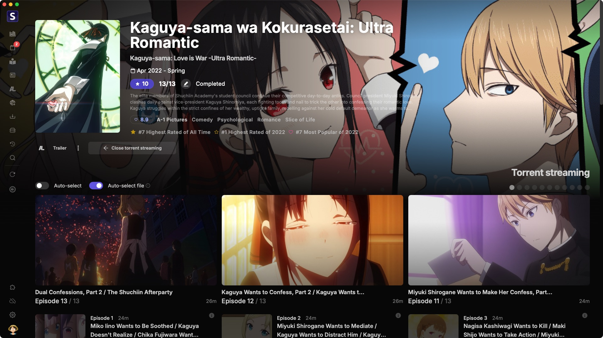

<p align="center">

</p>

<h2 align="center"><b>Seanime Desktop</b></h2>

<p align="center">
Desktop app for Seanime. Embeds server and web interface.
</p>



---

## Prerequisites

- Go 1.24+
- Node.js 20+ and npm
- Rust 1.75+

---

## Development

### Web Interface

```shell
# Working dir: ./seanime-web
npm run dev:desktop
```
 
### Sidecar

1. Build the server

	```shell
	# Working dir: .
 
	# Windows
	go build -o seanime.exe -trimpath -ldflags="-s -w" -tags=nosystray
 
	# Linux, macOS
	go build -o seanime -trimpath -ldflags="-s -w"
	```
 
2. Move the binary to `./seanime-desktop/src-tauri/binaries`

3. Rename the binary to `seanime-{TARGET_TRIPLE}`. [Reference](https://v2.tauri.app/develop/sidecar/).

	- `seanime-x86_64-pc-windows-msvc.exe` for Windows
    - `seanime-x86_64-unknown-linux-musl` for Linux
    - `seanime-x86_64-apple-darwin` for macOS (Intel-based)
    - `seanime-aarch64-apple-darwin` for macOS (Apple Silicon)

### Tauri

1. Setup

	```shell
	# Working dir: ./seanime-desktop
	npm install
	```
2. Run

    `TEST_DATADIR` is needed when running in development mode, it should point to a dummy data directory for Seanime.

    ```shell
    # Working dir: ./seanime-desktop
    TEST_DATADIR="/path/to/data/dir" npm run start
	# or
	TEST_DATADIR="/path/to/data/dir" tauri dev
   ```

---

## Build

### Web Interface

- **Option A:**
   
	Uses `.env.desktop` and outputs to `./seanime-web/out-desktop`

	```shell
	# Working dir: ./seanime-web
	npm run build:desktop
	```
 
	Move the output to `./web-desktop`

	```shell
	# UNIX command
	mv ./seanime-web/out-desktop ./web-desktop
	```
 
- **Option B:**
	
   Uses `.env.development.desktop` and outputs to `./web-desktop`
		
	```shell
	# Working dir: ./seanime-web
	npm run build:development:desktop
	```

### Sidecar

1. Build the server

	```shell
	# Working dir: .
 
	# Windows
	go build -o seanime.exe -trimpath -ldflags="-s -w" -tags=nosystray
 
	# Linux, macOS
	go build -o seanime -trimpath -ldflags="-s -w"
	```
 
2. Move the binary to `./seanime-desktop/src-tauri/binaries`

3. Rename the binary to `seanime-{TARGET_TRIPLE}`. [Reference](https://v2.tauri.app/develop/sidecar/).

	- `seanime-x86_64-pc-windows-msvc.exe` for Windows
    - `seanime-x86_64-unknown-linux-musl` for Linux
    - `seanime-x86_64-apple-darwin` for macOS (Intel-based)
    - `seanime-aarch64-apple-darwin` for macOS (Apple Silicon)

### Tauri

Set the signing private key and password. [Reference](https://v2.tauri.app/plugin/updater/#signing-updates).
- `TAURI_SIGNING_PRIVATE_KEY`
- `TAURI_SIGNING_PRIVATE_KEY_PASSWORD`

```shell
# Working dir: ./seanime-desktop
TAURI_SIGNING_PRIVATE_KEY="" TAURI_SIGNING_PRIVATE_KEY_PASSWORD="" npm run tauri build
```

Output is in `./seanime-desktop/src-tauri/target/release/bundle/...`
